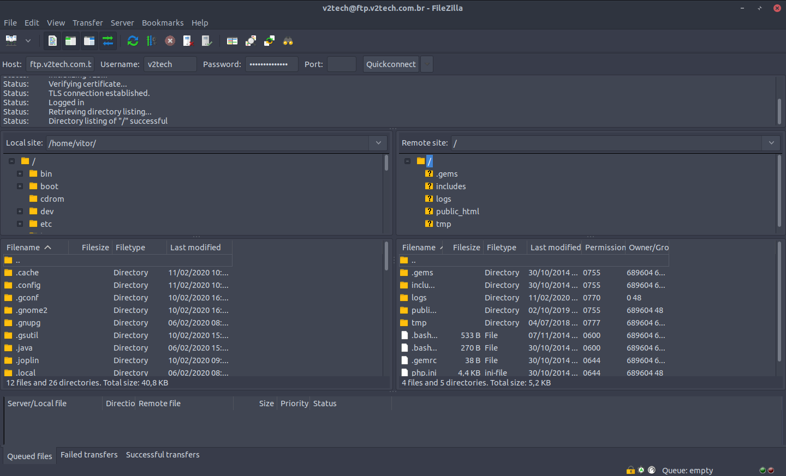
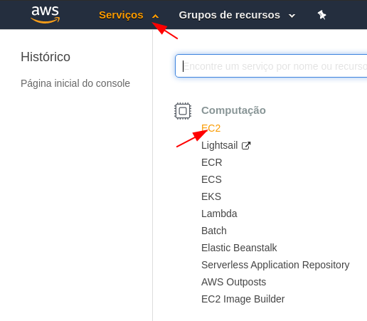
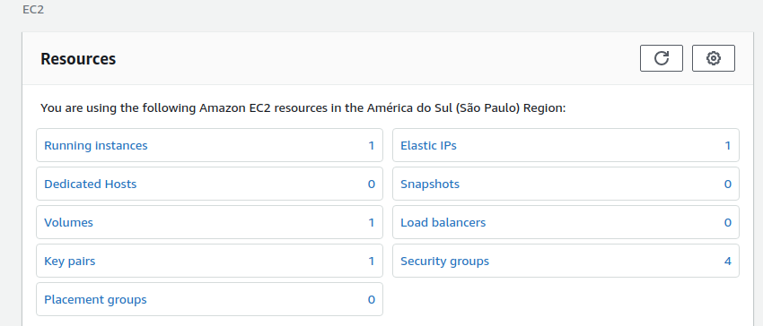
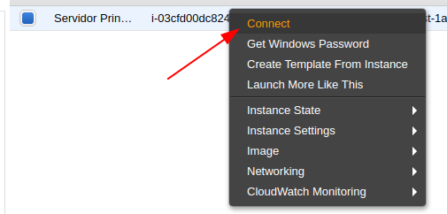
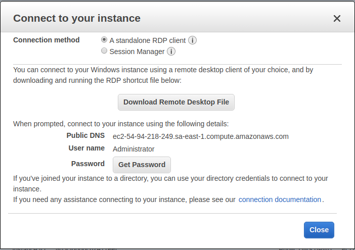
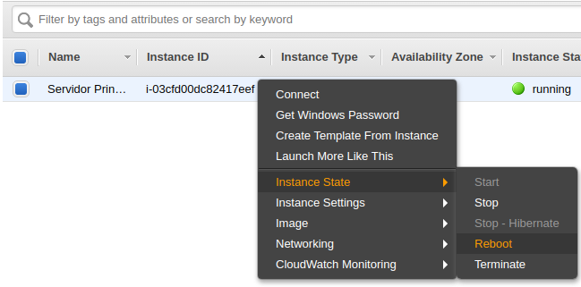

# Acesso ao FTP

> Acesso ao servidor FTP V2Tech (site)
> Software recomendado para uso [filezilla](https://filezilla-project.org/)

- **Senha:** rea6UQbUdEsJHe
- **Host:** ftp.v2tech.com.br
- **Username:** v2tech

# Alterar senha de email (Locaweb)

## Acesse o site da Locaweb pelo endereço

https://www.locaweb.com.br

Clique em **Central do Cliente** e informe o login e senha

- **Usuário:** clear0509
- **Senha:** Loguser01000x#

Clique em **Hospedagem para Profissionais**

Clique em **Administrar**

Encontre o email que deseja alterar a senha e clique em **Alterar Senha**

Informe a nova senha e clique para **Alterar Senha**

# Acesso painel EC2 AWS (Amazon)

Acesse o [console da AWS](https://sa-east-1.console.aws.amazon.com/console/home?region=sa-east-1)

- **Nome de usuário:** v2techti@gmail.com
- **Senha:** !ZeOIO28jp3git9l

Verifique se esta na região **São Paulo**

Clique em **Serviços** e posteriormente em **EC2**

Clique em **Running instances**

Nesta tela será listada as máquinas que estão atreladas a nossa conta. Atualmente (11/02/2020) temos apenas uma máquina ativa/configurada.

Clique com o botão direito do mouse e posteriormente em conect.

Clique em **Download Remote Desktop File** para baixar o arquivo de acesso a máquina virtual.

Utilize um gerenciador de acesso remoto de sua preferência para acessar a VM. No Windows pode-se utilizar o gerenciador de acesso remoto nativo do Windows.

**Senha de acesso:** yJCWrT@.l(w;pDQyBAYpSw&%srn;pHS3

### Resetar VM

<spam style="color: red"> Faça este processo apenas se a VM estiver "travada".

Caso não consiga acesso ao servidor IVMS nem pelo sistema de acesso remoto, acesse o console e clique com o botão direito na VM e posteriormente em **Instance State** e em **Reboot**

