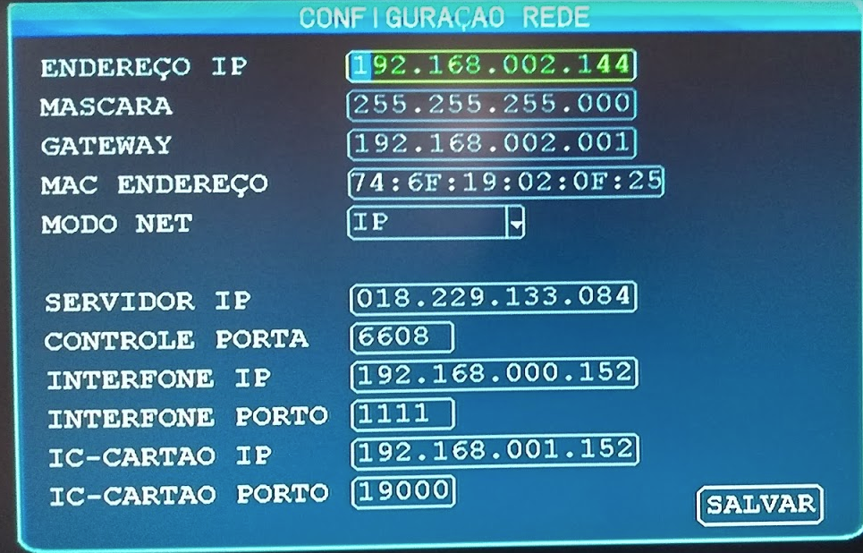

# Conectar antena externa Wifi (Ubiquiti) no MDVR (porta RJ45)

> Neste documento iremos configurar uma antena externa (nanostation) conectada na porta RJ45 (Ethernet) do MDVR para conexão via Wifi no roteador.

## Itens necessários

- Antena Nanostation
  - Recomendadmos a _NanoStation2_ da Ubiquiti
    - [Datasheet](https://dl.ubnt.com/ns2_datasheet.pdf)
    - [Manual](https://dl.ubnt.com/Nano_Quick_Set-up.pdf)
- Roteador
- Cabo de rede

## Configuração da Nanostation

Para realizar a configuração da Nanotation consulte o manual de sua antena. Abaixo iremos destacar as partes mais importantes como configuramos nossa NanoStation2.

### Aba Wirelless

No campo _SSID_ informe o nome da sua rede sem fio e no campo _WPA Preshared Key_ informe a senha da rede.

### Aba Network

No campo _Primary DNS IP_ preencha o endereço do servidor DNS: 1.1.1.1.

- Você pode inserir qualquer servidor DNS desejado, mas recomendados o da Cloud Flare.

### Configurando a porta ethernet do MDVR

Acesse a configuração _Network_.

> Todos os IPs inseridos nesta configuração devem ser da mesma rede que esta o roteador Wifi. Não utilizar o range de IP que acessou para configura-la.

|    Campo    |                       Informação                        |
| :---------: | :-----------------------------------------------------: |
| Endereço IP | Insira um endereço IP único para ser atribuido ao MDVR. |
|   Máscara   |          Insira o endereço de máscara de rede           |
|   Gateway   |                 Endereço IP do roteador                 |

No campo _Modo Net_ escolha IP ou Domain, conforme sua necessidade e informe o endereço do servidor. Caso utilize o servidor da V2Tech escolha o modo _domain_ e insira o endereço DNS 001.001.001.001

### Configuração da Antena externa no MDVR

Acesse a opção de configuração Wifi do MDVR.

|   Campo   |                                                       Informação                                                       |
| :-------: | :--------------------------------------------------------------------------------------------------------------------: |
| Wifi-Modo |                                             Selecione a opção **externo**                                              |
|   Habil   |                                               Insira a opção On (ligado)                                               |
|   SSID    |                                       Informe o SSID da rede que será conectado                                        |
|    AP     | Insira o endereço de IP da Nanostation (o mesmo que usou anteriormente para acessar a parte de configuração da antena) |
