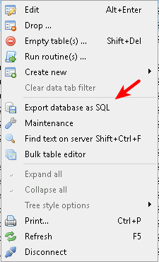

# Processo de transferência de dados para outro servidor

> Este processo envolve manipulação do banco de dados, portanto é uma atividade **critica** para o funcionamento do software servidor.   Execute os passos com bastante atenção.

Faça o download do software _HeidiSQL_ para acesso ao banco de dados ou use qualquer outro software gerenciandor de banco de dados de sua preferência.

[Heidisql - Download](https://www.heidisql.com/download.php)

Faça a instalação do Heidisql normal, clicando em next e aceitando o termo de uso.

## Execute o Heidisql e insira os dados para acesso a base de dados

- **Usuário:** root
- **Senha:** cmsserverv6
- **Porta:** 3321

Após acessar o banco de dados será mostrado todas as tabelas.

## Selecione as seguintes tabelas

Segure a tecla <kbd>Ctrl</kbd> e clique sobre as tabelas

- account
- db_version
- dev_brand
- dev_group
- dev_info
- dev_status
- dev_type
- map_marker
- user_dev_permit
- user_info
- user_preferences
- user_role

Clique com o botão direito do mouse e postariormente em **Export database as SQL**

Clique no ícone indicado para indicar o diretório que deseja exportar as tabelas do banco de dados.

> Caso tenha escolhido a opção para exportar os dados compactado no arquivo **.zip** não esqueça de descompactar antes de fazer a importação dos dados no próximo passo.

Feito estes passos anteriores já temos os dados exportados. Agora basta fazer a instalação do software servidor.

## Importar dados na "nova instalação"

Clique em **file** e em **Load SQL file**

Selecione os arquivos exportados anteriormente

Os dados foram importados da instalação anterior para a nova instalação.

Reinicie o Server Manager para aplicar as configurações importadas

