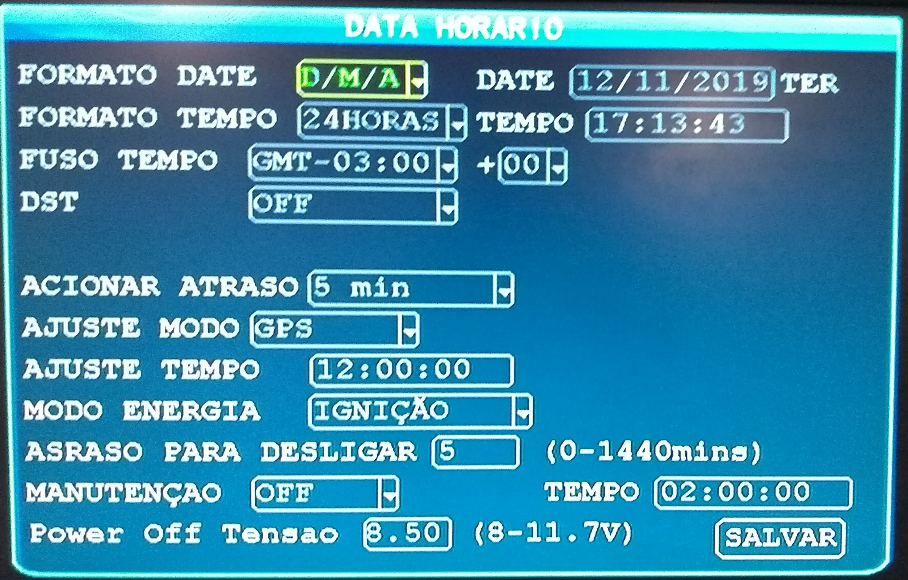
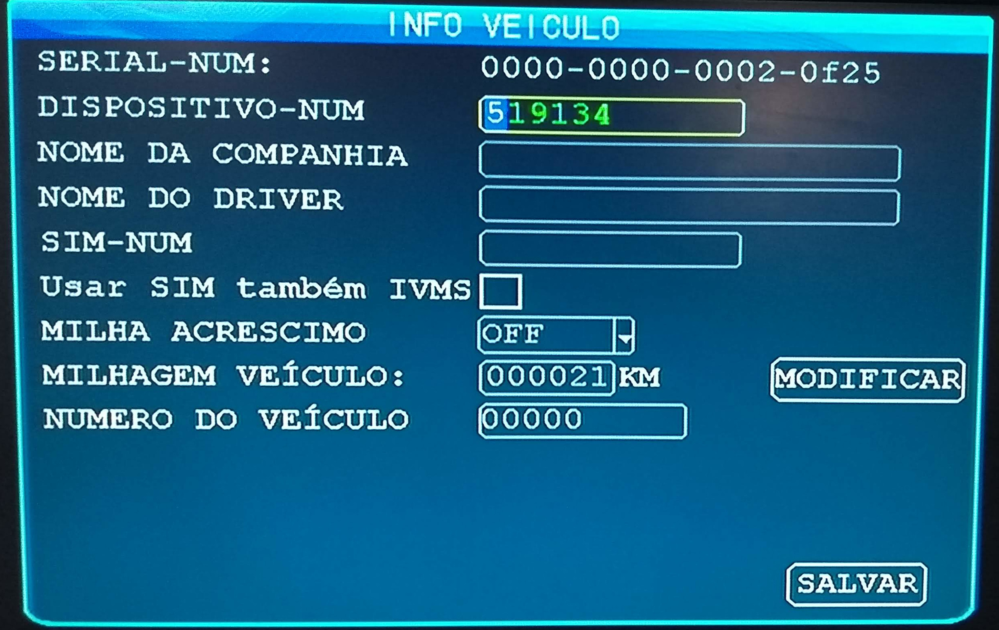
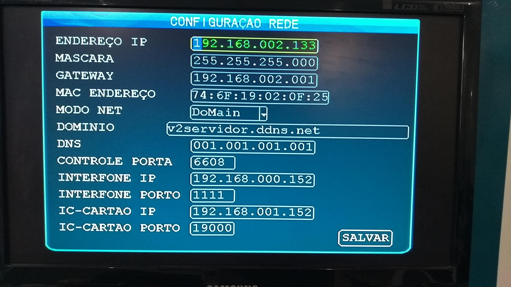
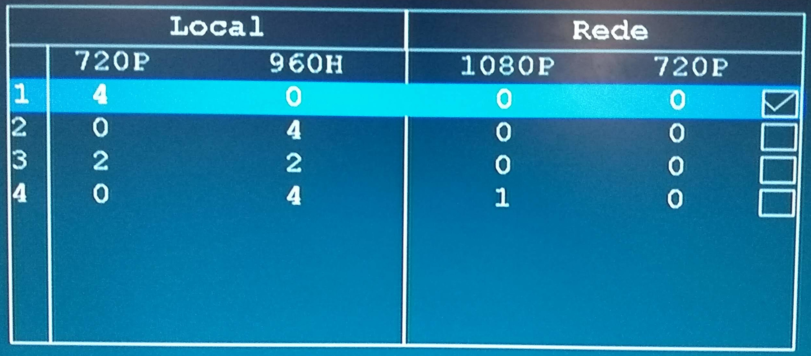
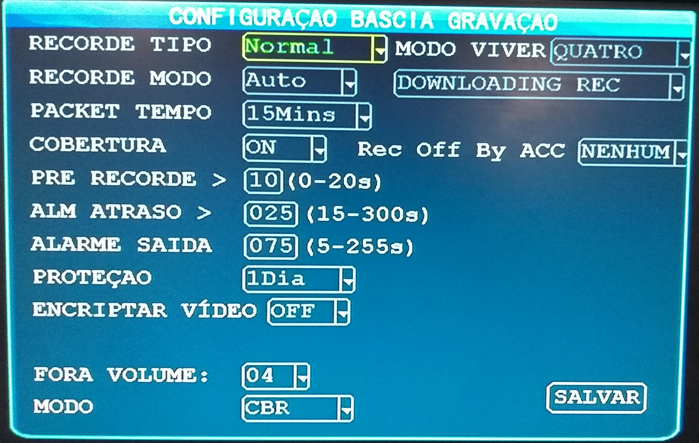
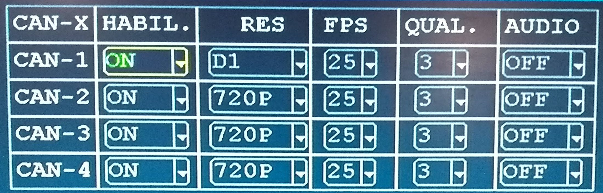
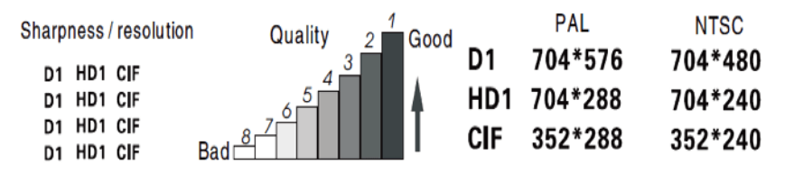
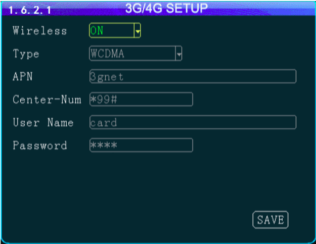

# Configuração básica

> Siga o passo a passo abaixo para configurar o MDVR para gravação e conexão com o servidor V2Tech.   Este processo de configuração é o mais comum.

## Data e Hora

_Geral/Data&Hora_

> Nesta tela iremos configurar a data e hora do dispositivo e o tempo que o equipamento deve permanecer ligado.

- Em _Formato Date_ escolha o formato da data desejado, o mais comum a ser utilizado é _D/M/A_ (dia/mês/ano).

- No campo _Date_ insira a data atual (caso o dispositivo tenha GPS instalado é provavel que já tenha sido preenchido automaticamente).

- Em _Fuso Tempo_ selecione GMT-03:00 ou outro caso esteja em uma região cujo fuso horário seja diferente do de Brasília.

- _DST_ é referente ao horário de versão, recomendamos que mantenha em _OFF_.

- _Acionar Atraso_ recomendamos que matenha o valor padrão de 5 min.

- _Ajuste Modo_ selecione GPS caso seu dispositivo tenha módulo GPS. Este recurso fará ajuste na data e hora automaticamente utilizando dados de GPS.

- A opção _Ajuste Tempo_ determina o horário que será ajustado a data/hora automaticamente pelo GPS.

- _Modo Energia_ é uma das configurações mais importantes, caso deseje que o equipamento seja _desligado_ depois de x minutos após desligar o veículo mantenha a opção _ignição_, ajuste o tempo que deseja desligar o equipamento no campo _Atraso para desligar_ o tempo desejado.

- Em _manutenção_ é definido o horário que o equipamento será reiniciado, recomendamos manter em **Off**.

## Veículo

_Geral/Veiculo_

> Nesta opção iremos configurar o IDNO (identificador do equipamento) no servidor.

!> Caso for utilizar o servidor da V2Tech, nos forneceremos este número, entre em contato e solicite o seu.

- No campo _Dispositivo-num_ insira o código para identificar o equipamento no servidor.

## Rede

_Geral/Rede_

> Aqui iremos configurar o MDVR para conectar no servidor, o exemplo abaixo é utilizando o servidor da V2Tech.

- Em _Modo Net_ altera para a opção _domain_.

- No campo _Dominio_ insira o endereço do servidor: _v2servidor.ddns.net_, ao abrir o teclado para digitar o endereço, aperte o botão - no controle remoto para remover o "espaço" presente na frente da primeira letra.

- No campo _DNS_ insira o IP: _001.001.001.001_

As demais informações permanecem padrão e os campos _Endereço IP, Mascara e Gateway_ são relacionados a porta RJ45 (interface ethernet).

## Modo Canal

> Nesta tela iremos configurar o tipo de câmera que será utilizada no MDVR.

1. Opção para quando é utilizado 4 câmeras HD de 720p
2. Esta opção é para quando utilizará 4 câmeras 960H
3. Esta opção é utilizado para 2 câmeras 720p e 2 câmeras 960H
4. Nesta opção é possível utilizar 4 câmeras 960H e 1 câmera IP 1080p

## Gravação

_Recorde/Normal_

> Aqui iremos configurar o tempo de cada pacote de vídeo e o tipo de gravação.

- _Recorde Tipo_ mantenha a opção _normal_.
- _Modo Viver_ selecione quatro para aparecer os 4 canais de vídeo.
- _Recorde Modo_ deve ser _auto_.
- _Cobertura_ é uma opção muito importante, pois nesta configuração que é definido se um arquivo de vídeo será sob-escrito por um vídeo mais novo. Se desativado quando o cartão de memória estiver cheio as gravações serão interrompidas. Se estiver ligado e o cartão de memória encher os novos vídeos serão gravados em cima dos vídeos mais antigos (reciclagem).

As demais configurações podem ser mantidas padrão como mostrado na imagem acima.

## Main Code

_Recorde/Main Code_

> Esta tela é muito importante pois é definido a qualidade da gravação do vídeo.

!> **Lembre-se que quanto maior a qualidade de gravação, mais espaço será necessário para armazenar os arquivos de vídeo de modo que o ciclo de gravações será reduzido.**

| Campo  | Informação                                                                                                                                                                                                         |
| ------ | ------------------------------------------------------------------------------------------------------------------------------------------------------------------------------------------------------------------ |
| RECORD | Esse campo habilita a gravação de cada um dos canais. **ON** para gravação habilitada **OFF** para gravação desabilitada                                                                                           |
| RES    | Define a resolução de gravação do canal. CH1 - CH4 - **D1,HD1,CIF,960H** CH5 - **720P,1080P**   É importante lembrar que quanto maior a resolução, maior será o espaço ocupado no dispositivo de armazenamento. |
| FPS    | Selecione qual será a taxa de quadros por segundo que será gravada no vídeo. Essa é uma configuração de fluidez de imagem. Quanto maior o valor, maior será a fluidez do vídeo.                                    |
| QUAL   | **(Valores de 1 a 8)** Essa é uma configuração de qualidade de imagem de gravação, quanto **menor** o valor, **melhor** a qualidade da imagem.                                                                     |
| Audio  | Permite habilitar a gravação de áudio, desde que o canal selecionado esteja equipado com um microfone **ON** Habilita a função **OFF** Desabilita a função                                                         |
| Enable | **ON** Habilita o alarme de perda de vídeo **OFF** Desabilita o alarme de perda de vídeo                                                                                                                           |

## Configuração 3G

_Perifericos/Sem Fio_

> Nesta parte iremos configurar o chip 3G. Para usar este recurso é importante salientar que é necessário ter o módulo 3G instalado no MDVR.

Na opção **wirelles** selecione a opção _ON_ em **type** selecione _WCDMA_ no campo **APN** insira a APN de sua operadora (veja nas tabelas abaixo), o **center-Num** deve ser o padrão como mostrado na imagem, **username** e **password** são de acordo com a sua operadora.

APN VIVO:

| Parâmetro | Descrição       |
| --------- | --------------- |
| APN       | zap.vivo.com.br |
| User Name | vivo            |
| Password  | vivo            |

APN Oi:

| Parâmetro |   Descrição    |
| :-------: | :------------: |
|    APN    | gprs.oi.com.br |
| User Name |       oi       |
| Password  |       oi       |

APN TIM:

| Parâmetro |  Descrição   |
| :-------: | :----------: |
|    APN    | timbrasil.br |
| User Name |     tim      |
| Password  |     tim      |

APN Claro:

| Parâmetro |  Descrição   |
| :-------: | :----------: |
|    APN    | claro.com.br |
| User Name |    claro     |
| Password  |    claro     |

Com estas configurações realizadas seu equipamento já esta apto a realizar gravações.