# Procedimento de como visualizar as imagens do HD

Realizar o download do software [Ext2Fsd](https://storage.googleapis.com/v2tech/Ext2Fsd-0.52.exe)

## Passos para instalação do Ext2Fsd

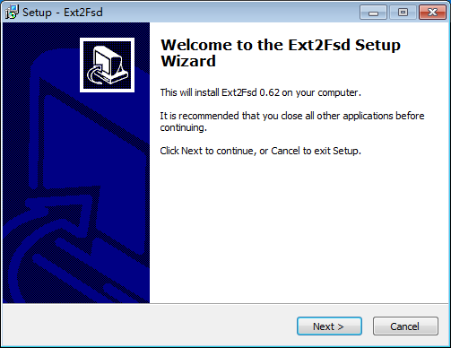

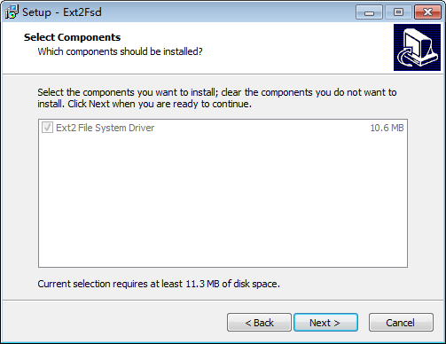

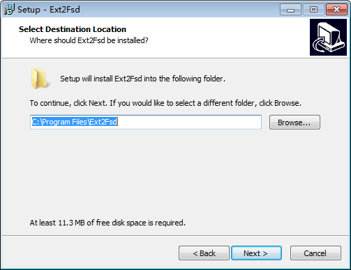

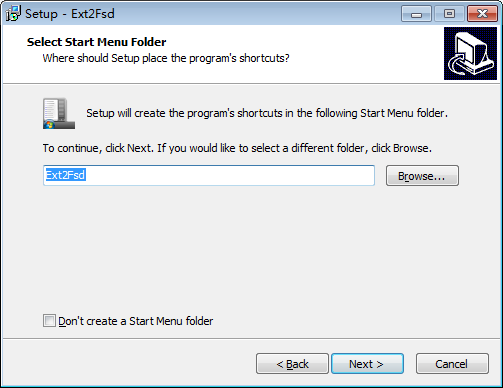

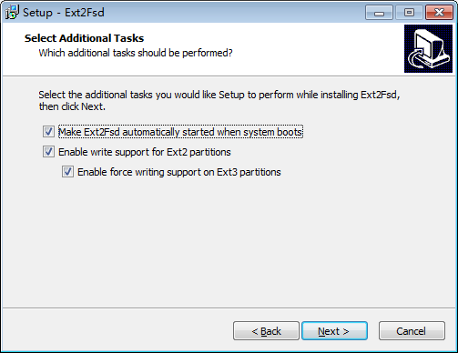

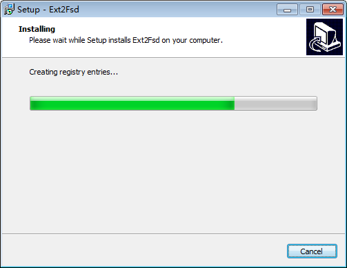

Após instalação execute o Ext2Fsd.

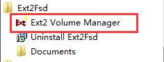

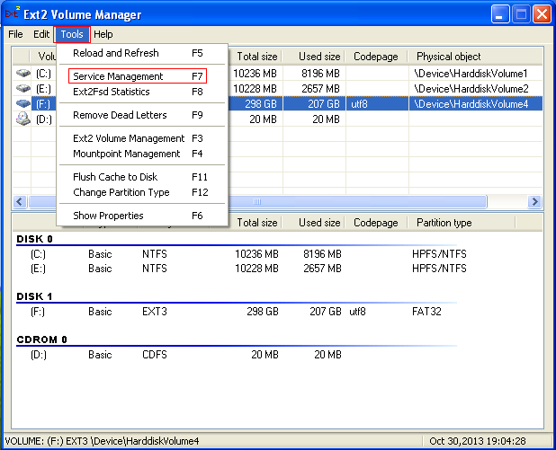

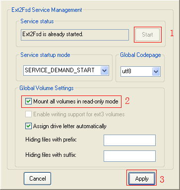

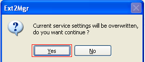

Depois de "montado" o disco, acesse a pasta correspondente aos vídeos.

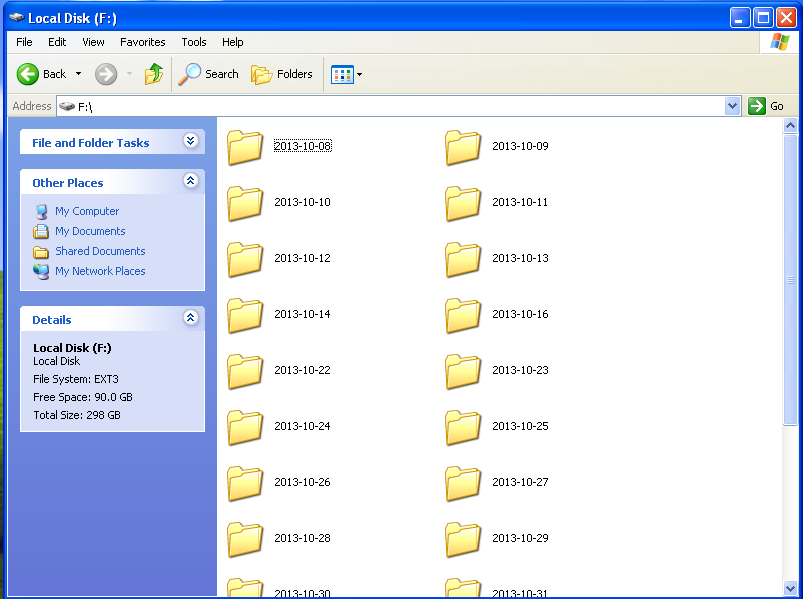

Caso tenha conseguido acessar a pasta do HD, acesse o MDVR Player e faça o procedimento padrão de visualização das imagens.
