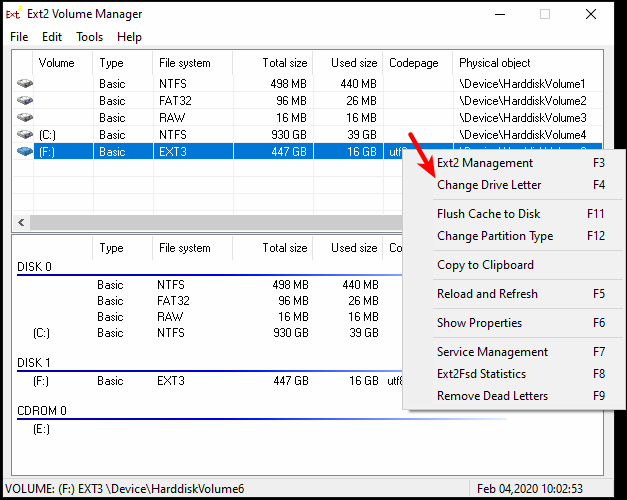

# Procedimento de como visualizar as imagens do HD

Faça o download do software [Ext2Fsd](https://storage.googleapis.com/v2tech/Ext2Fsd-0.52.exe)

## Passos para instalação do Ext2Fsd

**Mantenha as opções selecionadas como mostrado na imagem**

Após instalação execute o Ext2Fsd.

Clique com o botão direito do mouse sobre a unidade do disco usado no MDVR e posteriormente em **Change Drive Letter**

Verifique se já tem uma "letra" atribuída para identificação da unidade, caso negativo clique em **Add**

Selecione uma "letra" disponível e clique em **Ok**

Posteriormente clique em **Done**

Depois de "montado" o disco, acesse a pasta correspondente aos vídeos.

Caso tenha conseguido acessar a pasta do HD, acesse o MDVR Player e faça o procedimento padrão de visualização das imagens.

