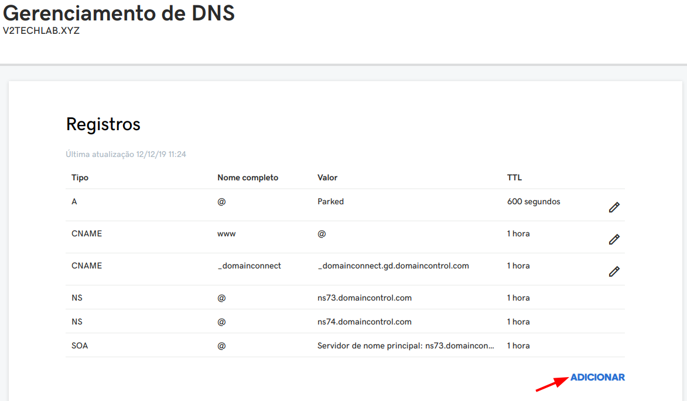

# Configuração de zonas de DNS

- Nesta etapa configuramos as zonas de DNS do domínio ao endereço **ip fixo** do servidor.

O domínio utilizado neste treinamento é **v2techlab.xyz**, troque este endereço para o seu domínio.

O serviço de gerenciamento deste domínio esta atrelado ao **GoDaddy**.

## Configuração GoDaddy





|     Campo     |          Informação           |
| :-----------: | :---------------------------: |
|     Tipo      |        Selecione **A**        |
|     Host      | Escreva o subdominio desejado |
| Apontada para |        IP do servidor         |
|      TTL      |            1 hora             |

# Download do Nginx

[Site oficial do Nginx para download](https://nginx.org/en/download.html)

- A versão que utilizei neste treinamento é _nginx/Windows-1.17.6_

Ao realizar o download descompacte no diretório desejado e execute o _nginx.exe_

# Redirecionamento de portas no roteador/firewall

Neste exemplo estou utilizando um rotedor _TP-Link WR940N v2/WR941ND v5_

> É necessário fazer o redirecionamento de portas para o servidor.
> Estaremos configurando o servidor web nginx na porta 80 e 443.
> Neste caso redirecionei as chamadas realizadas na porta 80 e 433 para o IP do servidor.

**Após finalizar os testes remova o redirecionamento da porta 80 (http) e mantenha apenas para a porta 443 (https)**.


## Teste de acesso via domínio

Ao realizar a configuração de redirecionamento de portas, executar o nginx e fazer a configuração das zonas de DNS do domínio temos que testar o acesso ao nginx.

Para testar basta acessar o endereço pelo navegador, no meu caso o endereço é: servidor.v2techlab.xyz e será mostrado a seguinte mensagem, informando o funcionamento do nginx.


# Gerar certificado com certbot (Linux)

[Certbot - Mais informações no site oficial](https://certbot.eff.org/)

Certbot é um projeto open source que gera certificados HTTPS usando o [Let’s Encrypt](https://letsencrypt.org/).

> Há diversas versões para diferentes distros Linux. Neste treinamento usaremos o Ubuntu para gerar os certificados. Caso optem por comprar algum certificado ou gerar de outra maneira pode pular este passo.

[Informações de instalação](https://certbot.eff.org/lets-encrypt/ubuntuother-nginx)

```shell
wget https://dl.eff.org/certbot-auto
sudo mv certbot-auto /usr/local/bin/certbot
sudo chown root /usr/local/bin/certbot
sudo chmod 0755 /usr/local/bin/certbot
```

Após fazer o download do arquivo execute o comando para executar o certbot.

```shell
sudo certbot certonly --manual --preferred-challenges dns
```

Será solicitado um endereço de email para receber lembretes para renovar o certificado. <br>
Os certificados tem validade padrão de **3 meses**, portanto será necessário fazer atualização a cada _90 dias_.

Ao informar o endereço de email será apresentado os termos do serviço. Pressione **A** para aceitar.

A próxima pergunta é se deseja entrar na lista de email da _Electronic Frontier Foundation_ que no caso não é obrigatório aceitar.

No próximo passo deve-se informar o domínio que será gerado o certificado, no meu caso entrarei com _servidor.v2techlab.xyz_.

Após executar este comando será solicitado que adicione um registro DNS TXT no seu domínio, pra isso acesse novamente a plataforma que gerencia o seu domínio, no meu caso é o _GoDaddy_.


> Ao adicionar o registro TXT pode ser que **demore** para escoar a nova configuração de DNS na web. Para verificar se o registro TXT já esta ativo use o comando abaixo:

```shell
dig @8.8.8.8 servidor.v2techlab.xyz
```

```shell
; <<>> DiG 9.11.4-3ubuntu5.4-Ubuntu <<>> @8.8.8.8 servidor.v2techlab.xyz TXT
; (1 server found)
;; global options: +cmd
;; Got answer:
;; ->>HEADER<<- opcode: QUERY, status: NOERROR, id: 65232
;; flags: qr rd ra; QUERY: 1, ANSWER: 0, AUTHORITY: 1, ADDITIONAL: 1

;; OPT PSEUDOSECTION:
; EDNS: version: 0, flags:; udp: 512
;; QUESTION SECTION:
;servidor.v2techlab.xyz.		IN	TXT

;; AUTHORITY SECTION:
v2techlab.xyz.		1799	IN	SOA	arnold.ns.xxxxx.com. dns.xxxxx.com. 2032784290 10000 2400 604800 3600

;; Query time: 60 msec
;; SERVER: 8.8.8.8#53(8.8.8.8)
;; WHEN: qui dez 12 16:07:06 -03 2019
;; MSG SIZE  rcvd: 115

```

Após confirmação do registro TXT, basta dar <kbd>Enter</kbd>

Se tudo tiver dado certo aparecerá uma mensagem semelhante a esta:

```shell
IMPORTANT NOTES:
 - Congratulations! Your certificate and chain have been saved at:
   /etc/letsencrypt/live/servidor.v2techlab.xyz/fullchain.pem
   Your key file has been saved at:
   /etc/letsencrypt/live/servidor.v2techlab.xyz/privkey.pem
   Your cert will expire on 2020-03-11. To obtain a new or tweaked
   version of this certificate in the future, simply run certbot
   again. To non-interactively renew *all* of your certificates, run
   "certbot renew"
 - If you like Certbot, please consider supporting our work by:

   Donating to ISRG / Let's Encrypt:   https://letsencrypt.org/donate
   Donating to EFF:                    https://eff.org/donate-le

```

O certificado gerado estará no diretório:

```shell
/etc/letsencrypt/archive/servidor.v2techlab.xyz
```

Copie os arquivos **fullchain.pem** e **privkey.pem** e armazene no mesmo diretório que "instalou" o Nginx.

# Configurando o Nginx

Crie um arquivo com o nome nginx.conf na raiz do diretório com o seguinte código:

```shell
worker_processes  1;

events {
  worker_connections  1024;
}

http {
	#include       mime.types;
	default_type  application/octet-stream;
	sendfile        on;
	keepalive_timeout  65;

	server {
		listen 80 default_server;
		listen [::]:80 default_server;
		server_name servidor.v2techlab.xyz;
		return 301 https://$host$request_uri;
	}

  	server {
		listen 443 ssl;
		server_name servidor.v2techlab.xyz;
		ssl_certificate C:/nginx-1.17.2/cert-certbot/fullchain1.pem;
		ssl_certificate_key C:/nginx-1.17.2/cert-certbot/privkey1.pem;

		location / {
			proxy_pass http://localhost:8080;
		}
	}
}
```

> Atenção aos campos que devem ser modificados de acordo com o seu domínio.

|        Campo        |                Informação                 |
| :-----------------: | :---------------------------------------: |
|     server_name     |   Alterar com o endereço do seu domínio   |
|   ssl_certificate   |            Path do certificado            |
| ssl_certificate_key |               Path da chave               |
|     proxy_pass      | Altera a parta que utiliza no IVMS Server |

## Executando o Nginx com o arquivo de configuração

```shell
.\nginx.exe -c .\nginx.conf
```

Uma dica interessante seria  configurar este script para ser executado automaticamente ao iniciar o Windows.

# Certificado HTTPS

Acesse o endereço de seu domínio no navegador e confira se esta acessando pelo HTTPS.


