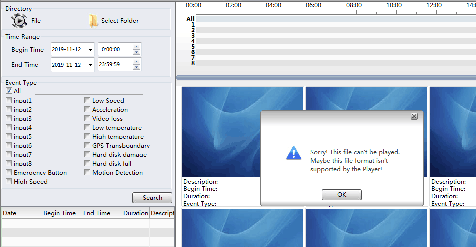
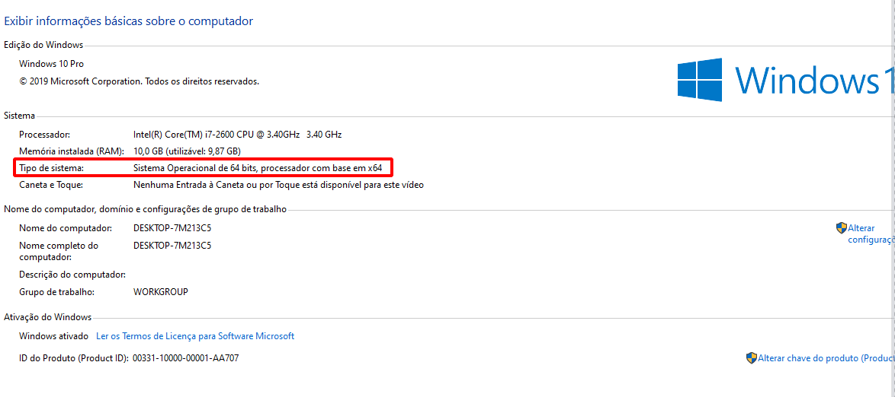
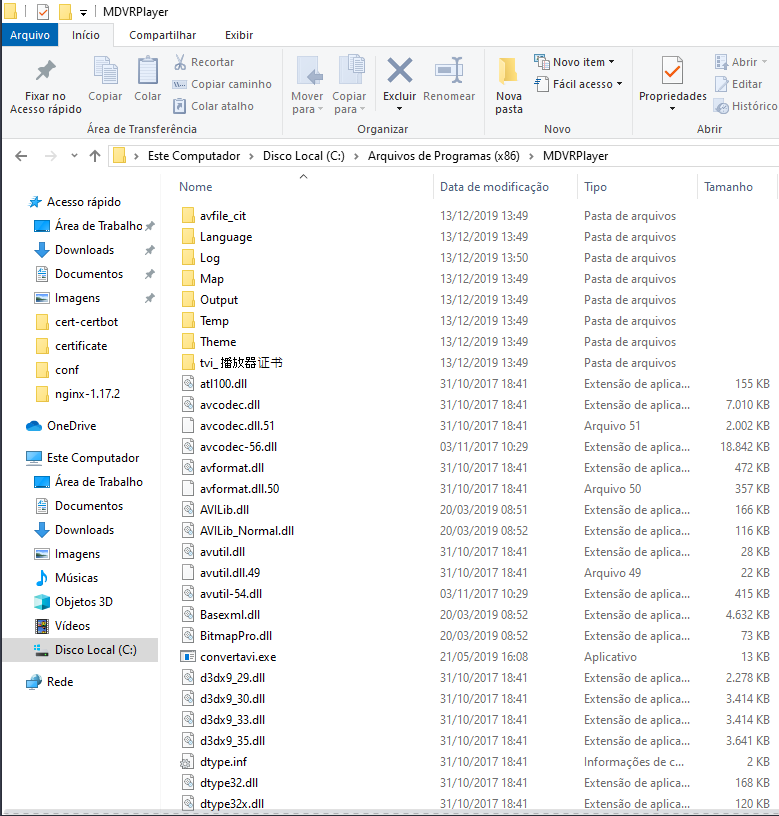

# Tela de erro do MDVR Player quando tenta visualizar as imagens do HD/SSD

# Verificar se o Windows é 32 bits ou 64 bits

Acesse o painel de controle e clique em **Sistema**

[Arquivos para versão 32 Bits](https://storage.googleapis.com/v2tech/32-fix-mdvr-player.zip)

[Arquivos para versão 64 Bits](https://storage.googleapis.com/v2tech/64-fix-mdvr-player.zip)

Acesse a pasta **C:\Program Files (x86)\MDVRPlayer**

Extraia os arquivos do pacote .zip que baixou dentro deste diretório substituindo os arquivos necessários.

---
