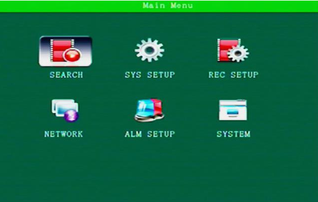

# MDVR

## Login

Para acessar o menu de login clique na tecla <kbd>Login</kbd>, aparecerá a tela abaixo solicitando a senha de administrador.

> A senha padrão é: **111111** ou **888888**

## Menu Principal

Menu principal de configuração do MDVR. Utilize as setas do controle remoto ou ligue um mouse da entrada USB frontal para navegar no menu.

## Record

> O dia que possui gravação é destacado em verde no calendário no lado esquerdo da tela.

Nesta tela podemos listar os vídeos gravados no cartão de memória selecionando o dia na opção **Date** e marcando o período de tempo gravado em **Start time** (hora de início) e **End time** (hora de fim) e o tipo de vídeo em **Video Type** entre os tipos:

- REC-ALL: Corresponde a todos os tipos de gravação
- REC-ALM: Corresponde a vídeos de eventos de alarme
- IO: Rabicho de entrada
- GSensor: Acelerômetro
- Speed: Alarme de Velocidade
- Move: Detecção de movimento
- Fatigue: Alerta de fadiga do motorista
- ** OCC**

**Disk Type**: Mídia de armazenamento que deseja realizar a busca.

Clique em **Show** para listar os arquivos de vídeos gravados.

Será mostrado todos os vídeos correspondente a data selecionada, aperte o botão <kbd>Play</kbd> para reproduzir o vídeo desejado.

** Export**

Descrição dos campos do resultado de busca

| Campo       | Descrição                     |
| ----------- | ----------------------------- |
| CHN         | Canal de vídeo                |
| Type        | Tipo de gravação              |
| Start       | Horário de início da gravação |
| End         | Horário de fim da gravação    |
| Size        | Tamanho do arquivo            |
| Record date | Data de gravação              |
