# Login

Para acessar o menu de login clique na tecla <kbd>Login</kbd>, aparecerá a tela abaixo solicitando a senha de administrador.

> A senha padrão é: **111111** ou **888888**

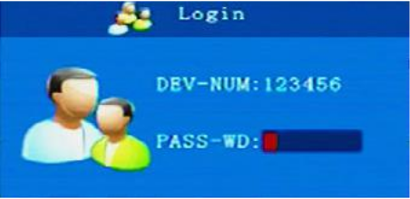

# Menu Principal

Menu principal de configuração do MDVR. Utilize as setas do controle remoto ou ligue um mouse da entrada USB frontal para navegar no menu.

# Record

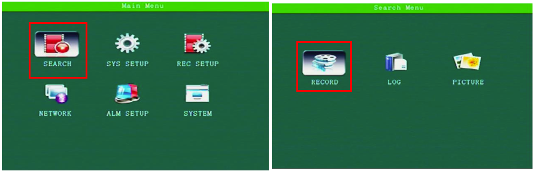

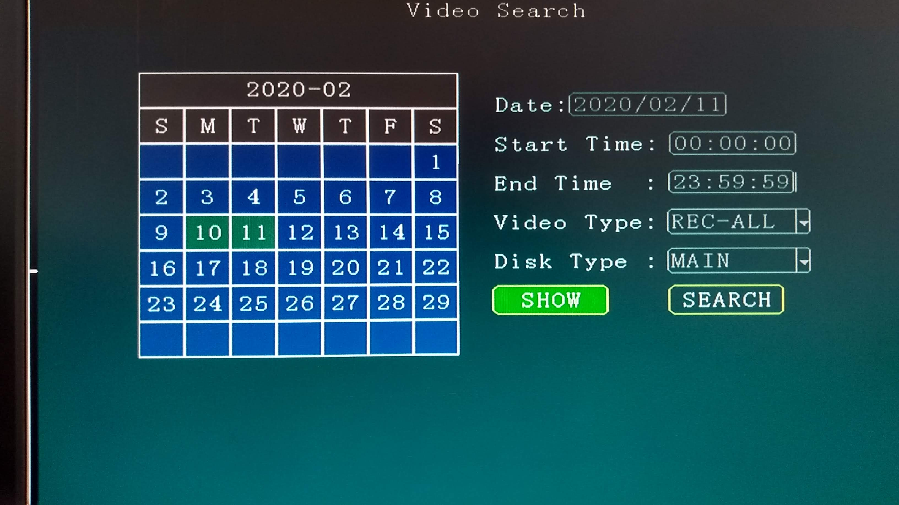

> O dia que possui gravação é destacado em verde no calendário no lado esquerdo da tela.

Nesta tela podemos listar os vídeos gravados no cartão de memória selecionando o dia na opção **Date** e marcando o período de tempo gravado em **Start time** (hora de início) e **End time** (hora de fim) e o tipo de vídeo em **Video Type** entre os tipos:

- REC-ALL: Corresponde a todos os tipos de gravação
- REC-ALM: Corresponde a vídeos de eventos de alarme
- IO: Rabicho de entrada
- GSensor: Acelerômetro
- Speed: Alarme de Velocidade
- Move: Detecção de movimento
- Fatigue: Alerta de fadiga do motorista
- ** OCC**

**Disk Type**: Mídia de armazenamento que deseja realizar a busca.

Clique em **Search** para listar os arquivos de vídeos gravados.

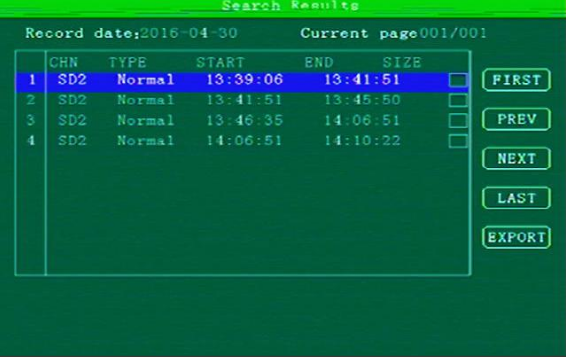

Será mostrado todos os vídeos correspondente a data selecionada, aperte o botão <kbd>Play</kbd> para reproduzir o vídeo desejado.

** Export**

Descrição dos campos do resultado de busca

| Campo       | Descrição                     |
| ----------- | ----------------------------- |
| CHN         | Canal de vídeo                |
| Type        | Tipo de gravação              |
| Start       | Horário de início da gravação |
| End         | Horário de fim da gravação    |
| Size        | Tamanho do arquivo            |
| Record date | Data de gravação              |

Clique em **Show** para listar os arquivos de vídeos gravados.

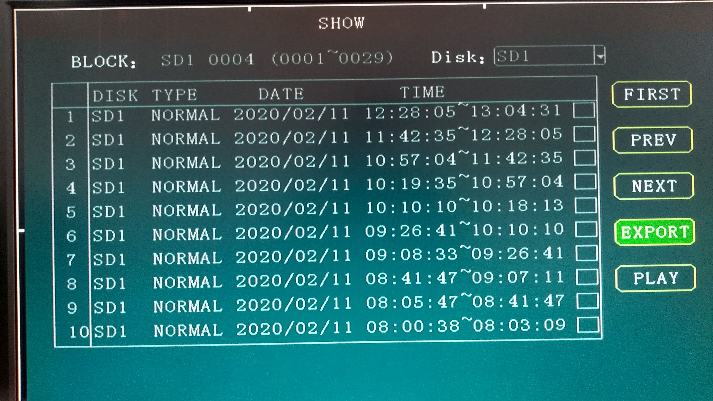

Como na opção anterior, os vídeos são listados conforme os campos de pesquisa preenchidos.

# Log

O recurso de log registra todos os eventos ocorridos no dispositivo tais como ligar, desligar, eventos de alarme, comportamento do módulo GPS, 3G/4G, conexão com o servidor entre outras informações importantes e alterações de configuração realizadas.

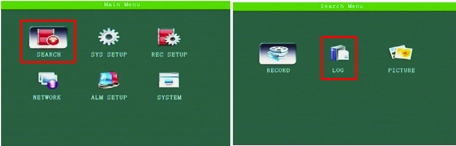

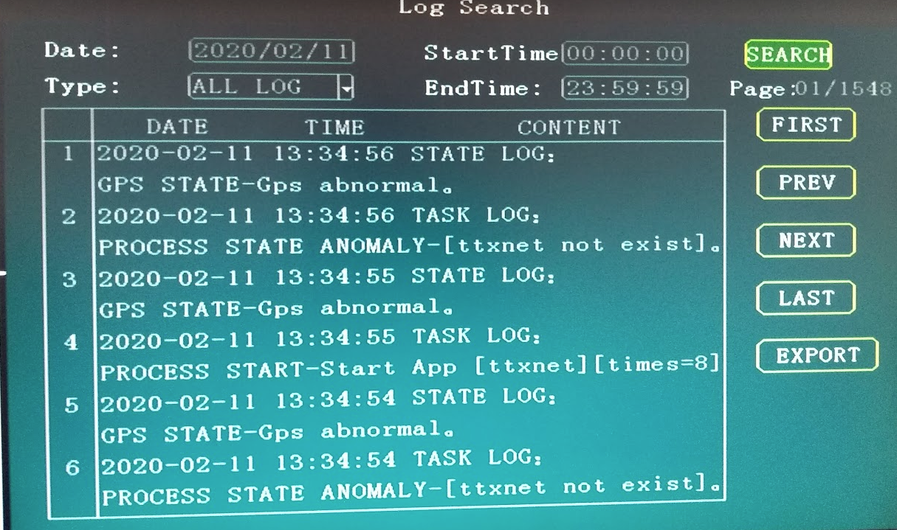

Descrição dos compos

| Campo      | Descrição                          |
| ---------- | ---------------------------------- |
| Date       | Dia que deseja fazer análise       |
| Start Time | Horário Inicial                    |
| Type       | Tipo de registro                   |
| End Time   | Horário de fim                     |
| Page       | Quantidade de páginas do relatório |
| Time       | Horário que ocorreu o evento       |

Os botões: _First_, _Prev_, _Next_, _Last_ são para navegar entre as páginas do relatório gerado.

# Picture

Realiza a busca de fotos armazenadas no sistema.

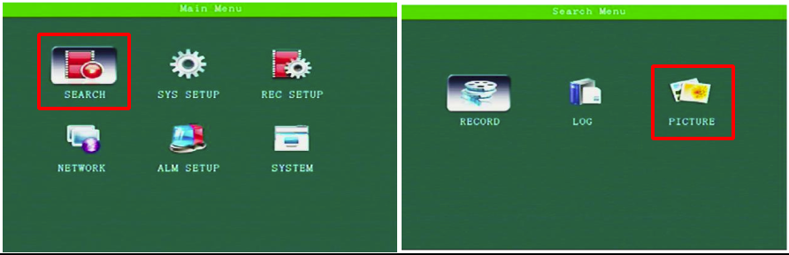

A navegação pelo resultado e o preenchimento dos filtros de busca é igual dos passos apresentados anteriormente.

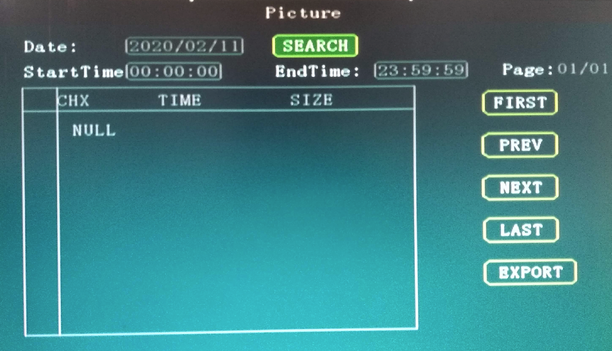

# Terminal

Nesta configuração iremos preencher informações sobre o dispositivo, veículo e dados para acesso ao servidor.

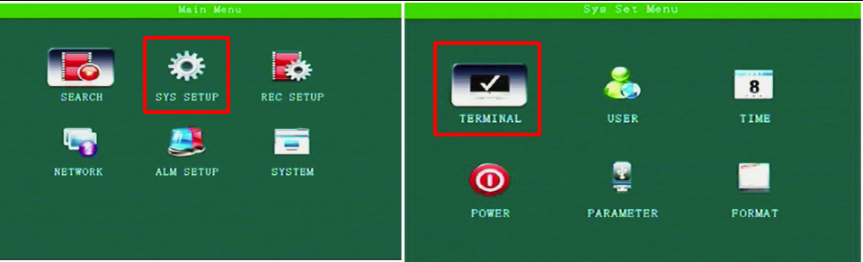

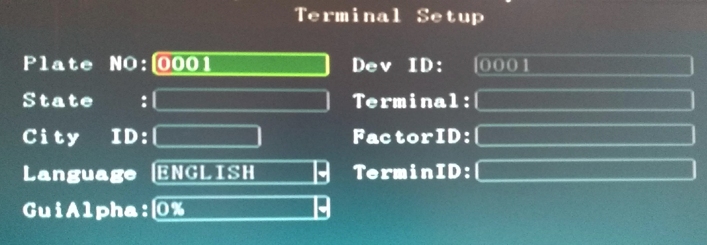

| Campo                                    | Descrição                                                                                           |
| ---------------------------------------- | --------------------------------------------------------------------------------------------------- |
| Plate No                                 | Dados da placa do veículo                                                                           |
| Dev Id                                   | Este é um código que deve ser único no servidor, caso for usar o da V2Tech iremos passar seu código |
| State                                    | Estado (UF)                                                                                         |
| City                                     | Cidade                                                                                              |
| Language                                 | Idioma                                                                                              |
| GuiAlpha |
| Terminal                                 |                                                                                                     |
| FactorID                                 |                                                                                                     |
| TerminID                                 |                                                                                                     |

# User

Interface para gerenciamento da conta de usuário para configuração do MDVR.

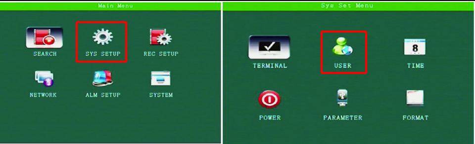

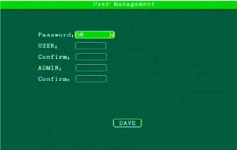

- **Password:** Opção para ativar ou desativar a necessidade de inserir senha para manipular as configurações do MDVR.
- **User:** Insira a senha para o usuário de nome User.
- **ADMIN:** Insira a senha para o usuário de nome Admin.
- **Confirm:** Confirme a senha, inserindo novamente.

# Time

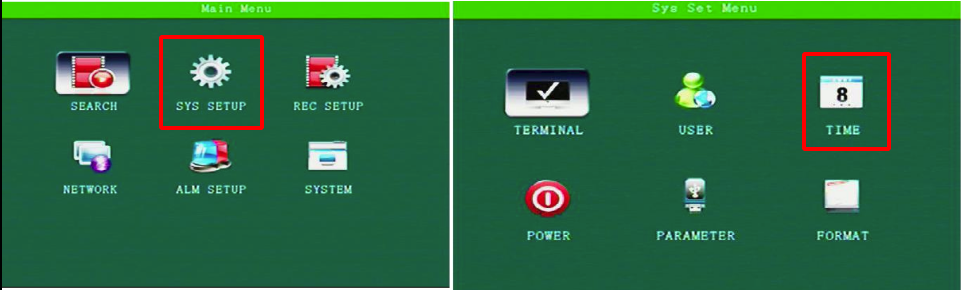
